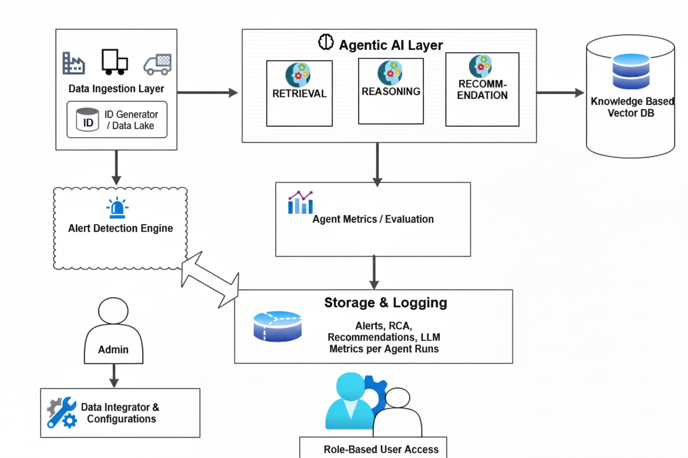

# 🧠 CPG Smart Alerting & Root Cause Analysis (RCA) AI System

## 🚀 Overview

The **CPG Smart Alerting System** is an **agentic AI-powered platform** designed to **monitor, detect, analyze, and recommend actions** for supply chain disruptions across Consumer Packaged Goods (CPG) networks.
It uses **autonomous agents**, **retrieval-augmented reasoning**, and **LLM-based analytics** to deliver real-time, explainable insights.

With this system, organizations can automatically identify issues like shipment delays, carrier inefficiencies, and operational bottlenecks — and receive **root cause analysis with actionable mitigation recommendations**.

---

## 🌐 Solution Architecture



**Key Components:**

1. **Data Monitoring Agent** — Continuously scans shipment data, performance metrics, and external signals (e.g., weather, traffic, logistics news).
2. **RCA Agent (Reasoning & Recommendations)** — Performs multi-step reasoning using LLMs to identify the root cause and propose mitigations.
3. **Guardrails Framework** — Implements Responsible AI governance (banned phrases, confidence thresholds, fairness & bias mitigation).
4. **RAG Evaluation Module (RAGAS + DeepEval)** — Evaluates the factuality, relevancy, and faithfulness of RCA outputs.
5. **Admin Dashboard** — Provides explainability, trace visualization, and configuration of AI guardrails and confidence parameters.
6. **Vector DB (Chroma)** — Stores contextual knowledge and shipment embeddings for retrieval.
7. **Streamlit UI** — Offers interactive visual dashboards for alerts, RCA summaries, and evaluation metrics.

---

## 🧩 Key Features

* 🔔 **Smart Alerting:** Detects potential disruptions automatically.
* 🧠 **Agentic RCA Engine:** Multi-step LLM reasoning with real-time context retrieval.
* 🛡️ **AI Guardrails:** Admin-configurable Responsible AI boundaries and fairness rules.
* 📊 **Metrics Dashboard:** Evaluate LLM reasoning performance using RAGAS & DeepEval.
* 🧭 **Explainability Mode:** Trace each agent step with reasoning transparency.
* ⚙️ **Configurable Confidence Thresholds:** Control automation based on model certainty.

---

## 🏗️ Tech Stack

| Component    | Technology                                              |
| ------------ | ------------------------------------------------------- |
| Backend      | Python 3.11, FastAPI (planned for future), Streamlit    |
| AI Engine    | OpenAI GPT-4o-mini (ReAct agent architecture)           |
| Vector DB    | Chroma                                                  |
| Evaluation   | RAGAS, DeepEval                                         |
| Config Store | JSON-based persistence                                  |
| Logging      | Custom Pino-compatible logger                           |
| UI           | Streamlit with Plotly visualization                     |

---

## ⚙️ Setup & Installation

### 1️⃣ Clone the repository

```bash
git clone hhttps://github.com/HiruInnovate/cpg_AI_alert.git
cd cpg_AI_alert
```

### 2️⃣ Create a virtual environment

```bash
python -m venv venv
source venv/bin/activate   # on Mac/Linux
venv\Scripts\activate      # on Windows
```

### 3️⃣ Install dependencies

```bash
pip install -r requirements.txt
```

### 4️⃣ Configure environment

Create a `.env` file in the project root:

```env
OPENAI_API_KEY=your-api-key-here
DATA_DIR=./data
```

### 5️⃣ Run the app

```bash
streamlit run ./run_app.py
```

---

## 🧩 Responsible AI & Guardrails

The system integrates a **Guardrails Configuration Layer**, editable by admins via UI:

* **Banned Phrases:** Blocks harmful or non-compliant recommendations (e.g., “cancel all shipments”).
* **Confidence Thresholds:** Controls automation vs. human review.
* **Business Rules:** Enforces fairness, validation from multiple sources, and realistic recommendations.
* **Fairness & Bias Mitigation:** Ensures unbiased RCA reasoning and equitable recommendations across carriers and regions.

Guardrails are defined in:

```
config/guardrails.json
```

---

## 📊 Evaluation Metrics

The **RAG Evaluation Page** measures:

* 🧩 *Faithfulness* — Does the answer align with the retrieved data?
* 🎯 *Answer Relevancy* — Is it directly answering the query?
* 🔍 *Context Precision* — Is the retrieved context relevant?

The **DeepEval Metrics Page** evaluates:

* ✅ *Factuality* and *Groundedness* for generated responses.

These insights guide continuous improvement of the AI reasoning process.

---

## 🌍 Data Sovereignty

This solution supports **data sovereignty enforcement**:

* Region-tagged data stores (India, EU, etc.)
* Localized LLM inference (on-prem / private Ollama / vLLM setup)
* Metadata-based data residency routing
* No cross-border data transfers unless explicitly approved

---

## 💡 Uniqueness of the Solution

* Combines **autonomous agents + reasoning LLMs** to perform self-driven root cause analysis.
* **Human-in-the-loop guardrails** ensure Responsible AI governance.
* **Cross-layer explainability:** Every decision is traceable from data to final recommendation.
* Designed specifically for **CPG supply chain resilience** and **operational transparency**.

---

## 🧩 Future Enhancements

* Integration with **FastAPI backend** for asynchronous agent orchestration.
* Enhanced visualization for **real-time RCA dependency graph**.
* Advanced evaluation metrics (factuality drift, reasoning consistency).
* Federated inference for multi-region data sovereignty compliance.

---

## 👥 Contributors

* **Hiranmoy Goswami** — Architecture, Agentic RCA, Streamlit Dashboard
* **Community Contributors** — Supply Chain Data Simulation & Test Scenarios
